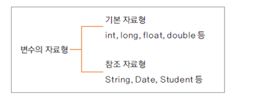

# 1. 참조 자료형 변수

변수는 크게 기본 자료형과 참조 자료형 2가지로 구분하여 사용한다.



- 기본 자료형은 사전에 자료 타입이 정해져 있으므로, 사용하는 메모리의 크기가 고정되어 있다.
- 참조 자료형은 객체를 참조하므로, 사용하는 메모리의 크기가 가변적이다.

- 참조 자료형을 사용할 때는 참조할 객체를 생성해야한다.
- 다만, String은 예외적으로 객체 생성 없이 타입 변수로 사용할 수 있다.


# 2. 참조 자료형 정의 및 사용 예시


위 그림처럼 Student 객체의 기능을 분리하고, Subject타입 참조 자료형을 사용하는 예시


#### Subject Class
```java
public class Subject {
	String name;
	int score;
	
	public Subject() {}
	
	public Subject(String name, int score) {
		this.name = name;
		this.score = score;
	}
}
```

#### Student Class

```java
public class Student {
	String name;
	int id;
	
	Subject korean;
	Subject math;
	
	
	Student(int id, String name){
		this.id = id;
		this.name = name;
		
		korean = new Subject();
		math = new Subject();
	}
	
	public void setKoreanSubject(String name , int score) {
		korean.name = name;
		korean.score = score;
	}
	
	public void setMathSubject(String name, int score) {
		math.name = name;
		math.score = score;
	}
	
	public void showTotalScoreInfo() {
		final int TOTAL_SCORE = korean.score + math.score;
		
		System.out.printf("%s 학생은 총 %d 점이다.\n", name, TOTAL_SCORE);
	}
}
```
#### Main 메서드 실행 코드

```java

public class MainClass {
	public static void main(String[] args) {
		Student user1 = new Student(1, "hong");
		user1.setKoreanSubject("국어", 100);
		user1.setMathSubject("수학", 90);
		
		user1.showTotalScoreInfo();
		
		
		
		Student user2 = new Student(1, "kong");
		user2.setKoreanSubject("국어", 80);
		user2.setMathSubject("수학", 70);
		
		user2.showTotalScoreInfo();
	}
}
```

#### 실행 결과

```java

hong 학생은 총 190 점이다.
kong 학생은 총 150 점이다.

```