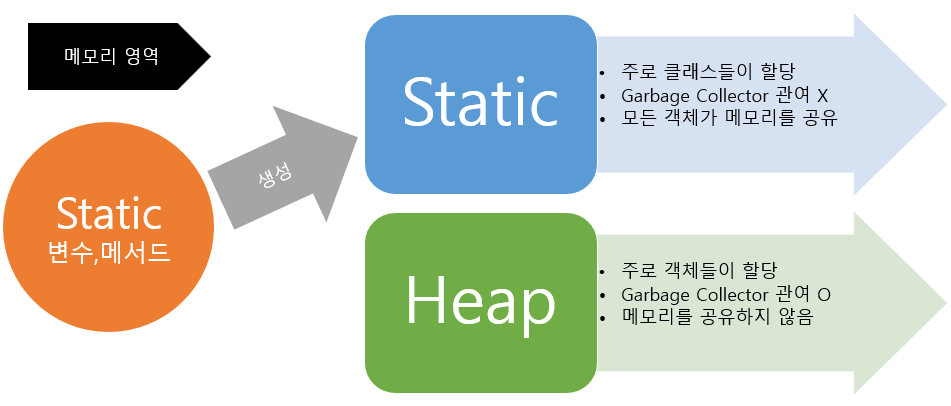

## 1. Static 키워드

정적, 고정된 의미를 가진 Static 키워드로 정적 변수와 정적 함수, 즉, 정적 맴버를 구현할 수 있다.\
정적 맴버는 인스턴스 객체에 종속되지 않고 클래스에 종속되어있어 객체 생성 없이 사용이 가능하다.\
\

> 출처 : https://coding-factory.tistory.com/524

## 2. Static 사용 시 이점

```객체간 공통으로 사용하는 값, 기능이 필요한 경우```에 사용한다.\
\
일상 생활에서 알림판이 있으면 일일히 전달하지 않고, 한번에 주민들이 공통으로 볼 수 있게 구성하는것처럼\
알림판(공통)에 있을 값과 기능은 static으로 선언하고, 주민(객체)들이 이를 공동으로 접근 가능하도록 구성한다.\
\

\
때문에, 자주 사용하는 상수(static final) 또는 언제든지 접근이 가능한 함수(static method)에 주로 사용된다.\
Static을 잘 사용하면 중복코드를 예방할 수 있지만, 모든 객체가 접근할 수 있으므로 보안 이슈가 발생할 수 있다.\


## 3. Static 사용 시 주의사항

#### 1. 프로그램 LifeCycle과 동일한 사이클
정적 맴버는 사용하지 않아도 프로그램 종료까지 메모리에 존재한다. 

#### 2. 프로그래머가 정적 맴버의 생성과 소멸을 제어할 수 없다.

프로그램을 메모리에 적재할 때 생성되고, 프로그램이 종료 시 소멸된다.
이는, 프로그래머가 생성과 소멸을 제어할 방법이 없다. 

#### 3. 안전하지 않은 스레드 사용

정적 맴버는 모든 프로그램에 공유되므로, 모든 스레드에서 접근할 수 있다.\
만약, 어떤 스레드에서 값을 변경할 경우 다른 스레드는 그 영향을 받게되므로, 동시성 이슈가 발생한다. 

#### 4. static 메서드는 오버라이딩 불가 

#### 5. 정적 맴버는 직렬화(Serialization) 불가능
직렬화는 인스턴스에만 적용되므로 클래스 정보인 정적 맴버에는 사용할 수 없다.

#### 6. 메모리 누수 가능성 
정적 맴버는 Garbage Collector가 인식하지 않아, 프로그램을 종료할 때까지 
메모리 해제를 안하므로, 많은 수의 정적 맴버가 존재할 경우 메모리 점유율이 높아진다.
static 메모리 공간에 데이터가 지속 생성되면 OutOfMemory 이슈가 발생할 수 있다.

최근에는 대부분 RAM 용량이 높아서 큰 문제가 안된다는 의견도 있으나,\
게임과 같이 데이터 생성 소멸이 잦고, 메모리를 많이 사용하는 프로그램에게는 치명적이다.

#### 7.  디버그 난이도 상승
정적 맴버는 전역으로 사용하기에, 어떤 곳에서 버그가 발생했는지 추척하는데 애로사항을 겪는다. 

## 4. Static 변수 사용법

변수 앞에 Static 키워드를 입력하면 된다.

#### 예시코드 - static 정적 맴버 구현
```java
static int number = 0;    // static 맴버 변수
static void printInfo() {}  // static 메서드
```

#### 예시 코드 - static 변수 사용 예시 [클래스명.static 변수]
```java
public class PostGenerator {
	private static int postIndex = 0;
	private int postID;
	private String postName;
	
	public PostGenerator(String postName) {
		postIndex++;
		this.postID = postIndex;
		this.postName = postName;
	}

	public void showPostInfo() {
		System.out.printf("'%s' 의 게시글 번호는 %d 이다.\n",this.postName, this.postID);
	}
	
	public static void main(String[] args) {
		System.out.println(PostGenerator.postIndex);  // [클래스명 . static 변수]
		
		PostGenerator post1 = new PostGenerator("가입인사");
		PostGenerator post2 = new PostGenerator("static 질문글");
		PostGenerator post3 = new PostGenerator("테스트코드");
		
		post1.showPostInfo();
		post2.showPostInfo();
		post3.showPostInfo();
	}
}
```
#### 실행 결과
```java
0
'가입인사' 의 게시글 번호는 1 이다.
'static 질문글' 의 게시글 번호는 2 이다.
'테스트코드' 의 게시글 번호는 3 이다.
```
다른 객체 생성 시, postIndex 값이 공유되는것을 확인할 수 있다.

## 5. Static 함수 사용법

함수 반환타입 앞에 static 키워드를 입력하면 된다.\
\
주의사항은 static 메서드(클래스 메서드)에서는 인스턴스 변수를 사용할 수 없다.\
메모리 생성 순서 문제인데, static 메서드는 인스턴스 생성과 무관하게 클래스 이름으로 호출 될 수 있기에\
인스턴스 생성 전에 호출 될 수 있으므로 static 메서드 내부에서는 인스턴스 변수를 사용할 수 없다.

#### 예제 코드 - static 메서드 사용
```java
public class PostGenerator {
	private static int postIndex = 0;
	private int postID;
	private String postName;
	
	public PostGenerator(String postName) {
		postIndex++;
		this.postID = postIndex;
		this.postName = postName;
	}
	
	public static void setPostIndex(int index) {
		PostGenerator.postIndex = index;
	}

	public void showPostInfo() {
		System.out.printf("'%s' 의 게시글 번호는 %d 이다.\n",this.postName, this.postID);
	}
	
	public static void main(String[] args) {
		System.out.println(PostGenerator.postIndex);
		
		PostGenerator post1 = new PostGenerator("가입인사");
		PostGenerator.setPostIndex(10);
		PostGenerator post2 = new PostGenerator("static 질문글");
		PostGenerator post3 = new PostGenerator("테스트코드");
		
		post1.showPostInfo();
		post2.showPostInfo();
		post3.showPostInfo();
	}
}
```
#### 실행 결과
```java
0
'가입인사' 의 게시글 번호는 1 이다.
'static 질문글' 의 게시글 번호는 11 이다.
'테스트코드' 의 게시글 번호는 12 이다.
```

출력 사이에 static 메서드로 게시글 인덱스를 변경하자, 모든 객체에 반영됨을 확인할 수 있다.