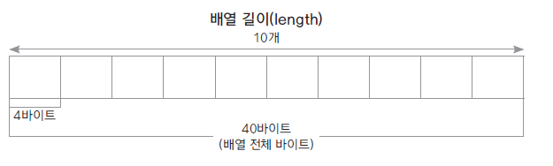

## 1. 배열
- 동일한 자료형 타입을 순차적으로 나열한 자료구조.
- index 연산자로 빠른 참조 가능
- 물리적 위치와 논리적 위치가 동일하다
- 배열의 index는 0부터 시작
- 서버에서 객체 배열 구현에 ArrayList를 많이 활용


## 2. 배열 선언과 초기화
- 배열 선언 시, 자동 초기화 ( 정수 : 0, 실수 : 0.0, 객체 : null )
- 사용자 지정 초기값 지정 가능
#### 2.1 배열 선언방법
```java
int[] arr1 = new int[10];
int arr2[] = new int[10];
```


#### 2.2 사용자 지정 배열 초기화
```java
// 방법1
int[] number = new int[] {10, 20, 30};

// 방법2
int[] number = {10,20,30};

// 방법3
int[] ids;
ids = new int[] {10,20,30};
```

## 3. 배열 사용법
- [] index 연산자를 활용하여, 요소가 저장된 메모리 위치를 참조한다.

#### 예시 코드 - 1부터 10까지 배열에 저장 후 총합 연산
```java
int arr = new int[10];
int total = 0;

for(int i=0, num=1; i < arr.length; i++, num++){
    arr[i] = num;
}

for(int i=0; arr.length; i++{
    total += arr[i];
}

System.out.println(total);
```

## 4. 배열 주의사항
#### 배열의 길이와, 요소의 개수가 다를 수 있다.
- 배열을 선언 시 요청한 크기만큼 메모리가 할당되는데, 값이 없을 수 있음(공실)
- 배열의 length는 배열 개수를 반환하므로, 요소의 개수를 알 수 없음

#### 예시코드 - length 사용 과정에서 원치 않는 요소 참조로 에러 발생
```java
double[] dArr = enw double[5];
double total = 1;

dArr[0] = 1.0;
dArr[1] = 2.0;
dArr[2] = 3.0;

for(int i = 0; i <dArr.lenght; i++{
    total *= dArr[i];
}

System.out.println(total);
```

#### 실행 결과
```java
0.0
```

원래 기대 값은 1.0~3.0을 곱한 6.0이지만, 실제 출력 결과는 0.0이다.
index 3번째부터는 자동 초기화된 0.0 값이 입력되어 실제 의도와 다르게 연산이 발생한다.
이를 해결하려면 요소의 개수를 저장할 별도의 변수를 만들어줘야 한다.

#### 예시코드 - 요소 개수를 저장하는 별도의 count 변수 추가
```java
double[] dArr = enw double[5];
double total = 1;
int count = 0;

dArr[0] = 1.1; count++;
dArr[1] = 2.2; count++;
dArr[2] = 3.3; count++;

for(int i = 0; i <count; i++{
    total *= dArr[i];
}

System.out.println(total);
```
#### 실행 결과
```java
6.0
```
의도한 목적에 맞게 연산이 됨을 확인할 수 있다.