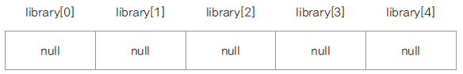

# 1. 객체 배열
- 기본 자료형 배열은 선언과 동시에 배열의 크기만큼의 메모리가 할당됨.
- 객체 배열의 경우엔 요소가 되는 객체의 주소가 들어갈 메모리만 할당되고(null) 각 요소 객체는 생성하여 저장해야 함



#### 예시코드 - Book 객체 생성 후 사용
```java
public class Book {

	private String title;
	private String author;
	
	public Book() {}
	
	public Book(String title, String author) {
		this.title = title;
		this.author = author;
	}

	public String getTitle() {
		return title;
	}

	public void setTitle(String title) {
		this.title = title;
	}

	public String getAuthor() {
		return author;
	}

	public void setAuthor(String author) {
		this.author = author;
	}
	
	public void showBookInfo() {
		System.out.println(title + "," +author);
	}

	public static void main(String[] args) {

		Book[] library = new Book[5];
				
		for(int i =0; i<library.length; i++) {
			System.out.println(library[i]);
		}
	}

}
```
#### 실행 결과
```java
null
null
null
null
null
```


# 얕은 복사
- 배열의 시작 주소만 복사.
- 배열의 값과 상태는 복사되지 않음.
- 즉, 같은 객체의 시작주소를 복사했으므로 참조 복사
- 장점 : 언제든 참조를 통해 접근 가능
- 단점 : 상태 변경 시 모든 참조변수에 적용됨

# 깊은 복사
- 기존과 다른 별도의 배열 객체 생성
- 배열의 값과 상태또한 복사
- 장점 : 별도의 복사 객체 생성
- 단점 : 메모리 공간 차지