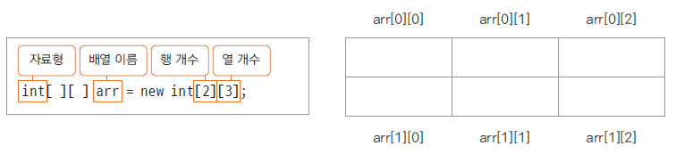

## 1. 다차원 배열?
- n차원으로 구성된 배열이다.
- 테이블형(2차원) 배열과 3D 공간형(3차원) 배열을 주로 사용한다.

#### 2차원 배열 예제 이미지



## 2. 다차원 배열 사용법
- 배열에서 [] 개수만큼 축을 정의할 수 있다.
- [] 이 1개면 1차원 배열, 2개면 2차원 배열이다.

#### 예제코드 - 2차원 배열 선언 및 출력
```java
public static void main(String[] args) {
	int[][] twoChanelArray = { { 1, 2, 3, 4, 5}, {6, 7, 8, 9, 10} };
	int i, j;
		
		
	for(i =0; i<twoChanelArray.length; i++) {
			
		for(j=0; j<twoChanelArray[i].length; j++) {
			System.out.print(twoChanelArray[i][j] + " ");
		}
		System.out.println();
	}
}
```
#### 실행 결과
```java
1 2 3 4 5 
6 7 8 9 10 
```

## 3. 일반 배열과 다차원 대열의 차이
- 기존 배열은 1개의 y축을 기준으로 자료형 데이터을 순차적으로 나열한 형태이다.
- 다차원 배열은 여러 축을 기반으로 자료형 데이터를 보관할 수 있다.

- 예컨데, 2차원 배열은 x, y 축 2개의 축을 기반으로 테이블 형태로 자료형 데이터를 보관한다.
- 3차원 배열은 x,y,z 축 3개의 축을 기반으로 3D 형태로 자료형 데이터를 보관한다.
- n차원 배열은 n개의 축을 기반으로 n차원 형태로 자료형 데이터를 보관한다.