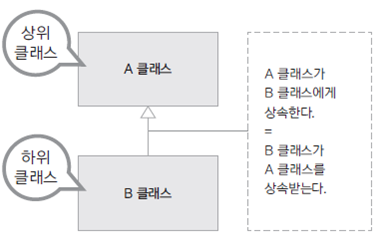

## 1. 클래스 상속

- 기존에 구현된 클래스의 속성과 기능을 상속(ingeritance) 받아 확장된 클래스를 설계한다.
- 기존 클래스보다 더 구체적이거나 확장하고 싶을 때 상속 기능을 사용한다.





> 상속하는 클래스 : 상위 클래스, parent class, base class, super class
> 상속받는 클래스 : 하위 클래스, child class, derived class, subclass

## 2. 상속 문법
- extends 키워드로 상속할 수 있다.
- Java는 단일 상속만 지원하므로, extends 뒤에 단 하나의 클래스만 명시 가능
- C++, C#은 다중 상속을 지원하므로, extends 뒤에 여러 클래스 명시 가능

```java
class B extends A{

}
```

## 3. 상속을 사용하는 경우
- 상위 클래스가 하위클래스보다 더 보편적인 개념과 기능을 가지는 경우
- 하위 클래스가 상위 클래스보다 더 구체적이거나 확장된 개념과 기능을 가지는 경우

ex) 동물 클래스(상위) <--- 사람 클래스(하위)


## 4. 상속 사용 예시
- 상속 기능을 활용하여 고객 등급 기능 구현


#### 일반 고객 클래스
- 고객 속성 : 고객번호, 이름, 등급, 보너스포인트, 적립비율
- 일반 고객은 구매 금액의 1% 적립

```java


```