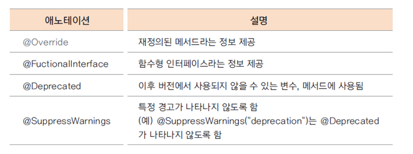

메서드를 재정의하는 방법은 크게 오버로딩, 오버라이딩으로 나눤다.\
이름이 비슷하여 헷갈릴 수 있으니 주의할 것.

## 1. 오버라이딩 (Overriding)
- 상위 클래스의 메서드를 하위 클래스에서 재정의 하는 방법이다.
- 하위 클래스에서 상위 클래스의 메서드를 재구현하면 된다.

```java
@Override
public int calcPrice(int price) {
	bonusPoint += price * bonusRatio;
	return price - (int)(price * salesRatio);
}
```

## 2. 애노테이션 ( Annotation )
- 애노테이션은 주석이다.
- 컴파일러에게 특별한 정보를 제공하는 역할을 수행한다.
- @overriding은 해당 메서드가 재정의 됬다는 의미를 전달하며, 선언부가 기존 메서드와 다른경우 에러 발생

