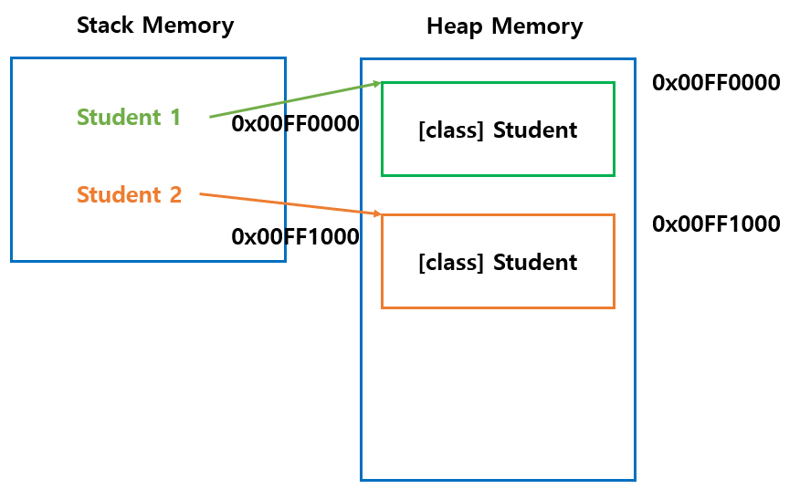

# 1. 인스턴스

- 클래스는 객체의 속성과 기능을 청사진 처럼 정의만 해놓은 상태이다.
- 클래스 기반으로 생성된 객체(인스턴스)는 각각 다른 맴버 변수 값을 가진다.
- ```new``` 키워드를 사용하여 인스턴스를 생성한다.


# 2. 힙 메모리

- 생성된 인스턴스는 동적 메모리(Heap Memory)에 할당된다.
- C, C++ 언어에서는 프로그래머가 직접 할당 및 해제를 수행한다.(free(), Delete)
- Java에서는 GC(garbage collector)가 주기적으로 사용하지 않는 메모리는 해제한다.

하나의 클래스로부터 여러 인스턴스가 생성하면\
stack memory에는 인스턴스 객체 참조 변수가\
heap money에는 객체 구성 요소가 생성된다.

